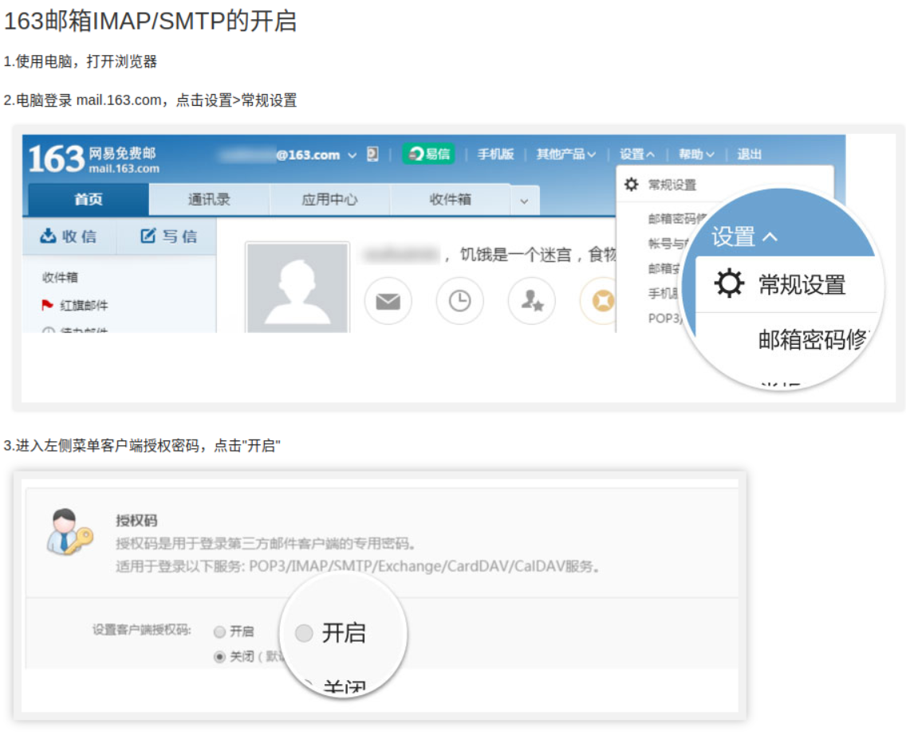

# LLMWatcher-2025/3/18
大模型监测-完成后发送邮件

### 步骤1 解压目录

解压目录，将包放在底下，进入包中，不要移动！！

### 步骤2 打开163邮箱的SMTP服务

### 步骤3 填入配置文件

建议163邮箱作为发送，qq邮箱作为接收

### 步骤5 配置大模型所需要的头文件

默认是torch，可以自行按照格式添加，例如sklearn

### 步骤6 运行文件

./run_with_hook.sh xxx.py

目标文件需要用脚本运行
### 成功示例

